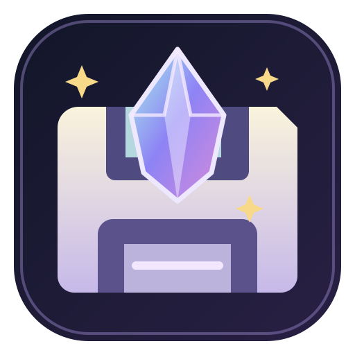

<div align="center">
  

  # RPG Save Editor

  **给 RPG Maker MV / MZ 游戏的存档编辑器**<br>
  为奇幻冒险、剧情与视觉小说风格的 RPG 整理背包、角色属性和游戏变量。

  [English](README.en.md) · [下载最新版](https://github.com/Owen-Liuyuxuan/rpg_save_editor/releases/latest) · [详细使用说明](使用说明.md)
</div>

---

> [!IMPORTANT]
> 目前仅支持 **Windows** 上的 RPG Maker **MV / MZ** 游戏。游戏题材不决定兼容性；请确认游戏目录里有 `js/rpg_core.js`（MV）或 `js/rmmz_core.js`（MZ）。

## 快速安装

1. 打开 [Releases](https://github.com/Owen-Liuyuxuan/rpg_save_editor/releases/latest)，下载 `RPGMakerSaveLab-Windows-Portable.zip`。
2. 将 ZIP **完整解压**到一个文件夹；双击其中的 `RPGMakerSaveLab.exe`。便携版无需安装 Node.js，也不需要管理员权限。
3. 点击“选择游戏目录”，选中包含 `js`、`data`、`save` 的游戏目录。MZ 使用 `.rmmzsave`，MV 使用 `.rpgsave`，程序会自动识别。
4. 选择存档、修改并应用，再点击“导出副本”。导出文件请保存到游戏 `save` 目录之外。

**请保留完整的解压目录。** 单独下载或移动 EXE 无法运行：它还需要同目录的 `resources`、`locales` 和运行库。需要把编辑后的存档放回游戏时，请先退出游戏并备份原槽位，再以原槽位文件名替换；详见[使用说明](使用说明.md)。

## 能做什么

| 功能 | 当前支持 |
| --- | --- |
| 游戏引擎 | 自动识别 RPG Maker MV / MZ |
| 存档 | 查看、搜索、修改、撤销、导出副本 |
| 可编辑内容 | 金币、已有背包物品、已有变量和开关、角色当前 HP/MP 与八项基础属性 |
| 安全措施 | 游戏目录只读；导出副本不覆盖已有文件；不执行游戏脚本 |

游戏可能使用插件或自定义存档格式，因此无法保证所有作品兼容。尚未完成导出存档在游戏内读档并继续游玩的全面验证。

## 开发安装

需要 **Windows、Node.js 22.12+、pnpm**。在仓库根目录运行 PowerShell：

```powershell
git clone https://github.com/Owen-Liuyuxuan/rpg_save_editor.git
cd rpg_save_editor\app
corepack enable
pnpm install --frozen-lockfile
pnpm dev
```

`pnpm dev` 会编译 Electron 主进程，启动 Vite 和桌面窗口。检查与打包：

```powershell
pnpm test
pnpm build
pnpm start
cd ..
.\package-portable.ps1
```

`package-portable.ps1` 将便携文件夹写入 `release/`，具体路径记录在 `release/latest.txt`；它不会自动生成 ZIP。运行 `.\install-windows.ps1` 可把该完整便携文件夹安装到当前用户的 `%LOCALAPPDATA%\Programs\RPGMakerSaveLab` 并创建快捷方式。

## 技术栈

**Electron**（Windows 桌面与受限 IPC） · **React 19 + TypeScript**（界面） · **Vite**（前端构建） · **Vitest**（测试） · **LZ-String**（MV 存档） · **Node.js zlib**（MZ 存档）。渲染器启用 `contextIsolation` 和沙箱；存档处理在带超时的 Worker 中进行。

项目图标位于 [`assets/logo.svg`](assets/logo.svg)。应用源码在 [`app/`](app/)；仓库不包含游戏、游戏数据库或个人存档。
